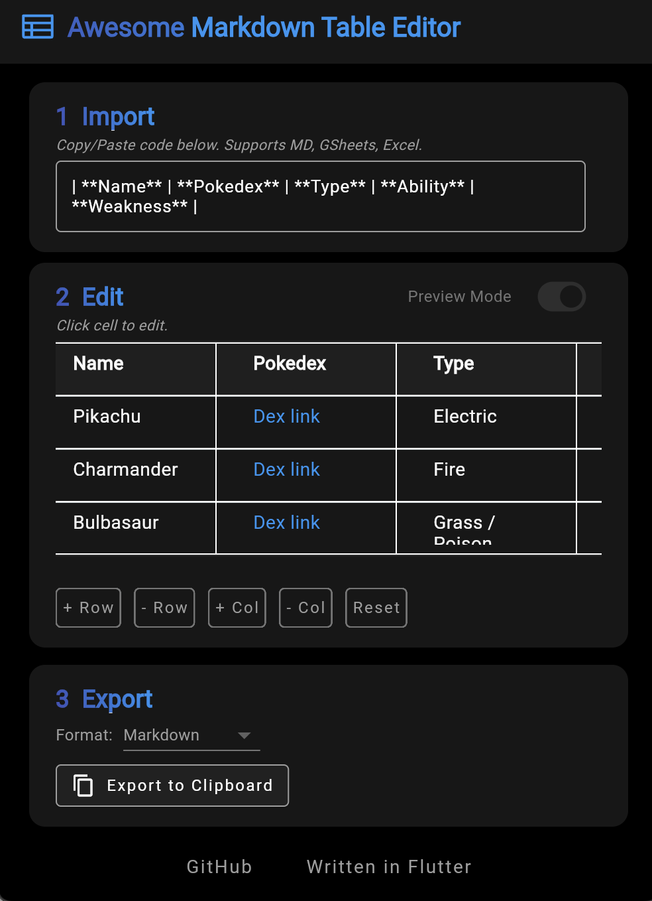

# *The Best* Markdown Table Editor

Easily edit markdown-coded tables with this client-side tool. Written in Flutter.



## Features

- **Intuitive Interface**: Simple and clean UI for editing markdown tables.
- **Real-time Preview**: See changes to your table as you edit.
- **Import/Export**: Easily import existing markdown tables and export your edits.
- **Cross-Platform**: Access the editor via web or as a desktop application.

## Installation

### Prerequisites

- Ensure you have [Flutter](https://flutter.dev) installed on your system. Follow the official Flutter installation guide if needed.

### Build Instructions

1. **Clone Repo** (if you haven't already):
   ```
   git clone https://github.com/yourusername/markdown-table-editor.git
   cd markdown-table-editor
   ```

2. **Run Locally**:
   To build and run the application locally on Chrome:
   ```
   flutter run -d chrome
   ```

3. **Build for Production**:
   To build the web version for deployment:
   ```
   flutter build web
   ```
   After building, copy and serve the contents of the `/build/web` directory on your web server.


## Contributing

Contributions are welcome! 

## License

This project is licensed under the MIT License - see the details below.

### MIT License

Permission is hereby granted, free of charge, to any person obtaining a copy
of this software and associated documentation files (the "Software"), to deal
in the Software without restriction, including without limitation the rights
to use, copy, modify, merge, publish, distribute, sublicense, and/or sell
copies of the Software, and to permit persons to whom the Software is
furnished to do so, subject to the following conditions:

The above copyright notice and permission notice shall be included in all
copies or substantial portions of the Software.

THE SOFTWARE IS PROVIDED "AS IS", WITHOUT WARRANTY OF ANY KIND, EXPRESS OR
IMPLIED, INCLUDING BUT NOT LIMITED TO THE WARRANTIES OF MERCHANTABILITY,
FITNESS FOR A PARTICULAR PURPOSE AND NONINFRINGEMENT. IN NO EVENT SHALL THE
AUTHORS OR COPYRIGHT HOLDERS BE LIABLE FOR ANY CLAIM, DAMAGES OR OTHER
LIABILITY, WHETHER IN AN ACTION OF CONTRACT, TORT OR OTHERWISE, ARISING FROM,
OUT OF OR IN CONNECTION WITH THE SOFTWARE OR THE USE OR OTHER DEALINGS IN THE
SOFTWARE.


## Acknowledgments

- Thanks to the Flutter community for their amazing framework and support.
- Inspired by the need for a simple markdown table editing tool.
